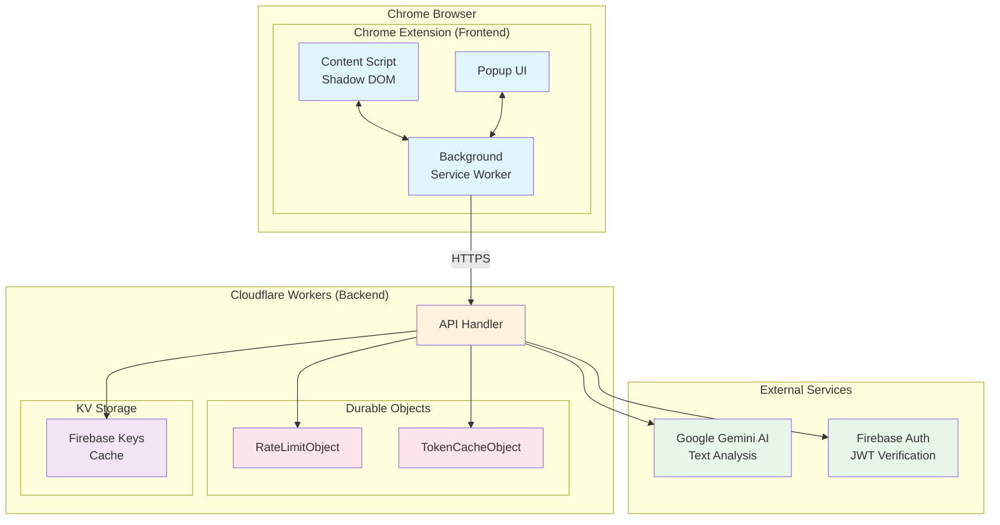

# Rocket Search AI

## 概要

Rocket Search AIは、Webページ上のテキストを選択するだけで、即座にAIによる解説を得ることができるChrome拡張機能です。難しい専門用語や外国語、複雑な概念に出会ったとき、コンテキストを離れることなくその場で理解を深めることができます。

**Chrome Web Store**: https://chromewebstore.google.com/detail/rocket-search-ai/doigkhmbgkhblbboacpglknapcfimcae

## サービスコンセプト

### 即座の理解支援
- Webページを読みながら、わからない単語や文章を選択するだけ
- 別タブを開いたり検索する手間なく、その場でAIによる解説を表示
- 学習、調査、情報収集の効率を大幅に向上

### 主な特徴
- **シンプルな操作**: テキスト選択 → 即座に解説表示
- **高精度AI**: Google Gemini AIによる文脈を考慮した適切な解説
- **セキュアな認証**: Google OAuth2 + Firebase認証
- **使用制限**: 1日20リクエストまで（無料プラン）

## システム構成

### アーキテクチャ概要



### 技術スタック

#### フロントエンド (Chrome拡張機能)
- **Framework**: React 19 + TypeScript
- **UI Library**: Mantine UI
- **Build Tool**: Vite + @crxjs/vite-plugin
- **認証**: Firebase Authentication (web-extension)
- **通信**: Chrome Extension APIs (Message Passing)

#### バックエンド (Cloudflare Workers)
- **Runtime**: Cloudflare Workers (Edge Computing)
- **AI Model**: Google Gemini 2.0 Flash Lite
- **認証**: firebase-auth-cloudflare-workers
- **ストレージ**: 
  - Durable Objects (レート制限、トークンキャッシュ)
  - KV Storage (Firebase公開鍵キャッシュ)
- **通信**: Server-Sent Events (SSE) for streaming

## ディレクトリ構造

```
rocket-search-ai/
├── frontend/                 # Chrome拡張機能
│   ├── public/              # 静的アセット
│   │   ├── icon/           # 拡張機能アイコン
│   │   └── _locales/       # 国際化ファイル
│   ├── src/
│   │   ├── background/     # Background Service Worker
│   │   ├── content/        # Content Script (Shadow DOM UI)
│   │   ├── popup/          # Popup UI コンポーネント
│   │   └── shared/         # 共通ユーティリティ
│   └── vite.config.ts      # Vite設定（動的マニフェスト生成含む）
│
├── request-ai/              # Cloudflare Workers バックエンド
│   ├── src/
│   │   ├── auth/           # 認証関連モジュール
│   │   ├── durable-objects/ # Durable Objects実装
│   │   │   ├── RateLimitObject.ts
│   │   │   └── TokenCacheObject.ts
│   │   ├── handlers/       # APIハンドラー
│   │   ├── utils/          # ユーティリティ関数
│   │   └── index.ts        # メインエントリーポイント
│   ├── test/               # テストファイル
│   └── wrangler.toml       # Cloudflare Workers設定
│
├── doc/                     # ドキュメント
│   └── authentication-system.md
└── README.md               # プロジェクトドキュメント
```

### 主要コンポーネントの役割

#### Frontend Components
- **Content Script**: Webページに注入され、テキスト選択UIを提供（Shadow DOM使用）
- **Background Script**: APIとの通信、認証管理、メッセージパッシング
- **Popup**: 拡張機能アイコンクリック時のUI（ログイン/ログアウト）

#### Backend Components
- **API Handler**: リクエスト処理、認証、レスポンスストリーミング
- **RateLimitObject**: ユーザーごとの使用制限管理（SQLite使用）
- **TokenCacheObject**: JWTトークンの高速キャッシュ
- **KV Storage**: Firebase公開鍵の永続キャッシュ

## 開発環境のセットアップ

### 必要条件
- Node.js 18+
- npm (フロントエンド・バックエンド共通)
- Cloudflare アカウント
- Firebase プロジェクト
- Google Cloud Console (OAuth2設定)

### フロントエンド開発
```bash
cd frontend
npm install
npm run dev  # 開発サーバー起動 (localhost:5173)
```

### バックエンド開発
```bash
cd request-ai
npm install
npm run dev  # Wrangler開発サーバー起動
```

### 環境変数設定

#### Frontend (.env)
```
VITE_GOOGLE_CLIENT_ID=your-google-client-id
VITE_EXTENSION_PUBLIC_KEY=your-extension-public-key
```

#### Backend (wrangler.toml + secrets)
```bash
wrangler secret put GEMINI_API_KEY
# Firebase設定はwrangler.tomlに記載
```

## セキュリティ機能

- **エンドツーエンド認証**: Firebase JWT による完全な認証フロー
- **レート制限**: ユーザーごと1日20リクエストまで
- **トークンキャッシュ**: パフォーマンス最適化とDoS攻撃対策
- **CORS設定**: 拡張機能からのリクエストのみ許可
- **HTTPS通信**: 全ての通信をHTTPSで暗号化
