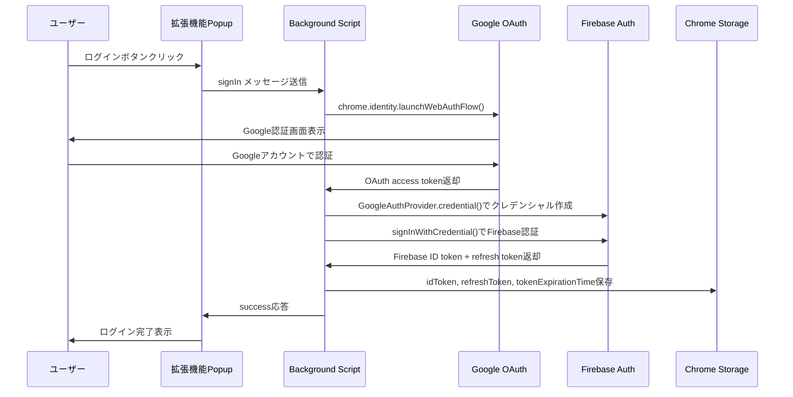
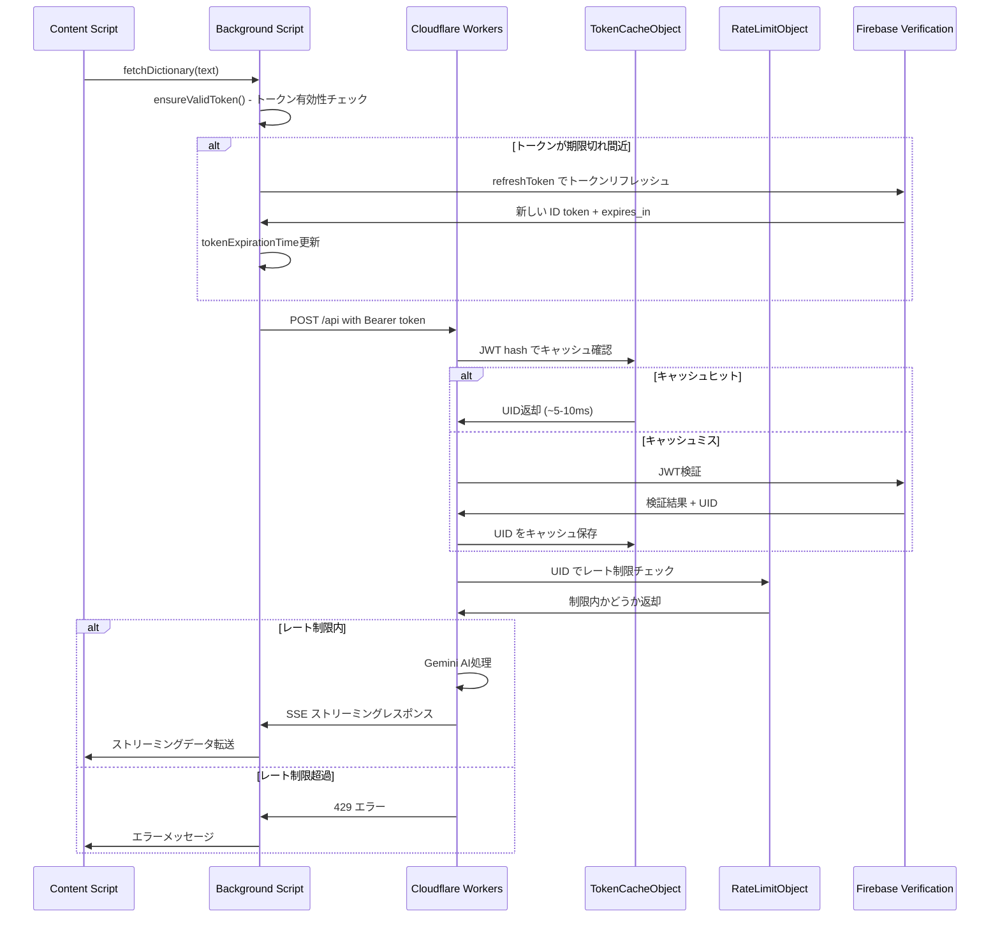
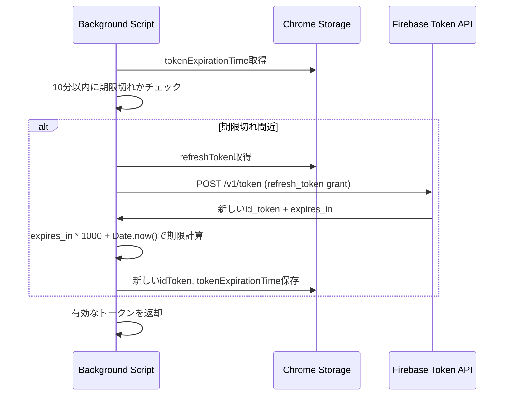

# Rocket Search AI 認証システム詳細ドキュメント

## システム概要

Rocket Search AI Chrome拡張機能は、Firebase認証とGoogle OAuth2を使用した包括的な認証システムを実装しています。フロントエンド（Chrome拡張機能）とバックエンド（Cloudflare Workers）が連携し、高性能で安全な認証フローを提供します。

## アーキテクチャ概要

### フロントエンド構成
- **Chrome拡張機能** - React + TypeScript
- **Firebase Authentication** - Google OAuth2統合
- **Chrome Identity API** - ブラウザ認証フロー
- **Chrome Storage API** - トークン永続化

### バックエンド構成
- **Cloudflare Workers** - サーバーレスAPI
- **Durable Objects** - ステートフル認証キャッシュ
- **KV Store** - Firebase公開鍵キャッシュ
- **firebase-auth-cloudflare-workers** - JWT検証

## 詳細な認証フロー

### 1. 初回ログインフロー



### 2. API リクエスト認証フロー



### 3. プロアクティブトークンリフレッシュフロー



## トークン管理の詳細

### フロントエンド トークン管理

#### 保存されるデータ
```typescript
interface StoredTokenData {
  idToken: string;           // Firebase ID token (JWT)
  refreshToken: string;      // Firebase refresh token
  tokenExpirationTime: number; // ミリ秒単位の期限
}
```

#### 有効期限チェック
```typescript
const isTokenExpiringSoon = (expirationTime: number): boolean => {
  const tenMinutesFromNow = Date.now() + (10 * 60 * 1000);
  return expirationTime <= tenMinutesFromNow;
};
```

#### プロアクティブリフレッシュ
- **トリガー**: トークンが10分以内に期限切れになる場合
- **方法**: Firebase Token APIの`expires_in`フィールドを使用
- **フォールバック**: プロアクティブリフレッシュが失敗した場合の強制リフレッシュ

### バックエンド 認証キャッシュシステム

#### TokenCacheObject (Durable Object)
```typescript
class TokenCacheObject {
  // JWT hash → UID のマッピングをキャッシュ
  // SHA-256ハッシュでセキュリティ確保
  // 1時間後の自動クリーンアップ
}
```

#### キャッシュ戦略
1. **ハッシュ化**: SHA-256でJWTをハッシュ化してセキュリティ確保
2. **TTL管理**: トークンの有効期限と同期した自動削除
3. **パフォーマンス**: キャッシュヒット時は5-10ms、ミス時は100-200ms

#### レート制限システム
```typescript
class RateLimitObject {
  // UID → リクエスト数のトラッキング
  // 24時間ウィンドウで20リクエスト制限
  // SQLite永続化
}
```

## セキュリティ機能

### 1. トークンセキュリティ
- **ハッシュ化キャッシュ**: JWTをSHA-256でハッシュ化してキャッシュ
- **自動削除**: トークン期限切れ時の自動キャッシュクリア
- **HTTPS通信**: 全ての通信でHTTPS強制

### 2. レート制限
- **ユーザー単位制限**: 1日20リクエスト
- **分散管理**: Durable Objectsによる一貫した制限実施
- **コスト管理**: 過度な利用を防ぐ経済的制約

### 3. エラーハンドリング
- **認証エラー**: 自動トークンリフレッシュ
- **ネットワークエラー**: リトライ機構
- **レート制限**: ユーザー向け分かりやすいエラーメッセージ

## パフォーマンス最適化

### 1. 多層キャッシュシステム
```
リクエスト → TokenCache (Durable Object) → KV Store → Firebase検証
    ↓           ↓                          ↓          ↓
   ~5ms        ~10ms                    ~50ms      ~200ms
```

### 2. プロアクティブ管理
- **事前トークンリフレッシュ**: ユーザーがエラーに遭遇する前に更新
- **バックグラウンド処理**: ユーザー操作をブロックしない

### 3. 効率的なストレージ
- **Chrome Storage API**: 高速ローカルストレージ
- **最小限のデータ**: 必要最低限の認証情報のみ保存

## 設定と環境変数

### フロントエンド設定
```typescript
// vite.config.ts
oauth2: { 
  client_id: process.env.GOOGLE_CLIENT_ID,
  scopes: [
    'https://www.googleapis.com/auth/userinfo.email', 
    'https://www.googleapis.com/auth/userinfo.profile'
  ],
}
```

### バックエンド設定
```toml
# wrangler.toml
[env.production]
name = "request-ai"
vars = { FIREBASE_PROJECT_ID = "web-extention" }

[[env.production.durable_objects.bindings]]
name = "TOKEN_CACHE"
class_name = "TokenCacheObject"

[[env.production.durable_objects.bindings]]
name = "RATE_LIMIT"
class_name = "RateLimitObject"
```

## エラー処理とフォールバック

### 認証エラーパターン
1. **トークン期限切れ**: 自動リフレッシュ → 再試行
2. **リフレッシュトークン無効**: ユーザーに再ログイン要求
3. **ネットワークエラー**: 段階的リトライ
4. **レート制限**: 24時間後の自動リセット通知

### フォールバック戦略
```typescript
// プロアクティブリフレッシュ失敗時の強制リフレッシュ
if (!response.ok && response.status !== 429) {
  console.log('プロアクティブリフレッシュでも失敗したため、強制的にリフレッシュします');
  const refreshedIdToken = await refreshIdToken(refreshToken);
  // 再試行
}
```

## 監視とデバッグ

### ログ出力
- **認証フロー**: 各ステップでの詳細ログ
- **パフォーマンス**: キャッシュヒット率、レスポンス時間
- **エラー**: 認証失敗の詳細な原因

### メトリクス
- **認証成功率**: ユーザー認証の成功/失敗率
- **トークンリフレッシュ頻度**: プロアクティブ vs リアクティブ
- **API レスポンス時間**: キャッシュ効果の測定

## 運用上の考慮事項

### スケーラビリティ
- **Durable Objects**: 自動的な地理的分散
- **エッジコンピューティング**: ユーザーに近い場所での処理
- **ステートレス設計**: 水平スケーリング対応

### 保守性
- **TypeScript**: 型安全性によるバグ削減
- **モジュール化**: 認証ロジックの分離
- **設定外部化**: 環境変数による設定管理

### セキュリティ監査
- **トークン有効期限**: 適切な期限設定（1時間）
- **暗号化通信**: 全てHTTPS
- **最小権限**: 必要最小限のOAuth2スコープ

この認証システムは、現代的なWebアプリケーションのセキュリティ要件を満たしながら、Chrome拡張機能特有の制約に対応した設計となっています。