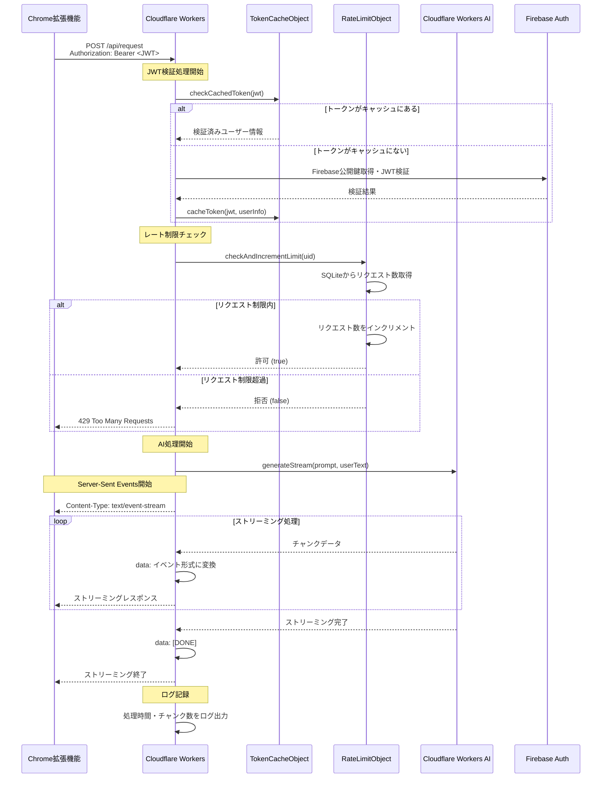

# バックエンド処理シーケンス図

Cloudflare Workers内での処理フローを示します。

## 主要コンポーネント

### TokenCacheObject (Durable Object)
- JWTトークンの検証結果をキャッシュ
- パフォーマンス最適化のため重複検証を回避
- SQLiteストレージで永続化

### RateLimitObject (Durable Object)  
- ユーザーごとのレート制限管理
- 24時間ウィンドウで20リクエスト/日の制限
- SQLiteでリクエスト数を追跡

### エラーハンドリング
- JWT無効: 401 Unauthorized
- レート制限超過: 429 Too Many Requests  
- AI処理エラー: 500 Internal Server Error