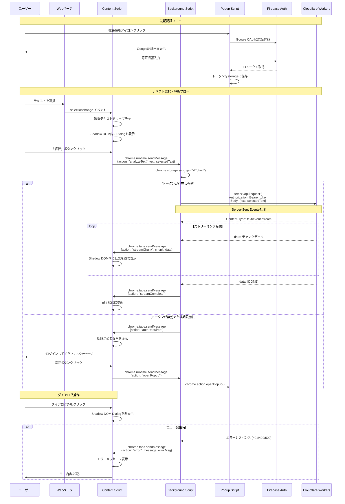

# フロントエンド処理シーケンス図

Chrome拡張機能内での処理フローを示します。

## 主要コンポーネント

### Content Script
- Webページに注入される
- Shadow DOMでUI分離
- テキスト選択の検出とキャプチャ
- Background Scriptとの双方向通信

### Background Script (Service Worker)
- Chrome拡張機能の中核
- Content ScriptとAPI間の仲介
- 認証トークンの管理
- SSEストリーミングの処理

### Popup Script
- 拡張機能アイコンクリック時のUI
- Google OAuth2認証フロー
- 初期設定とトークン管理

## 通信方式

### chrome.runtime.sendMessage / onMessage
- Content ↔ Background間の通信
- 非同期メッセージング

### chrome.tabs.sendMessage
- Background → Content への一方向通信
- ストリーミングデータの配信

### chrome.storage.sync
- 拡張機能全体でのデータ永続化
- 認証トークンの保存

## Shadow DOM活用
- ホストページのCSSとの競合回避
- 独立したスタイルスコープ
- セキュアなUI表示