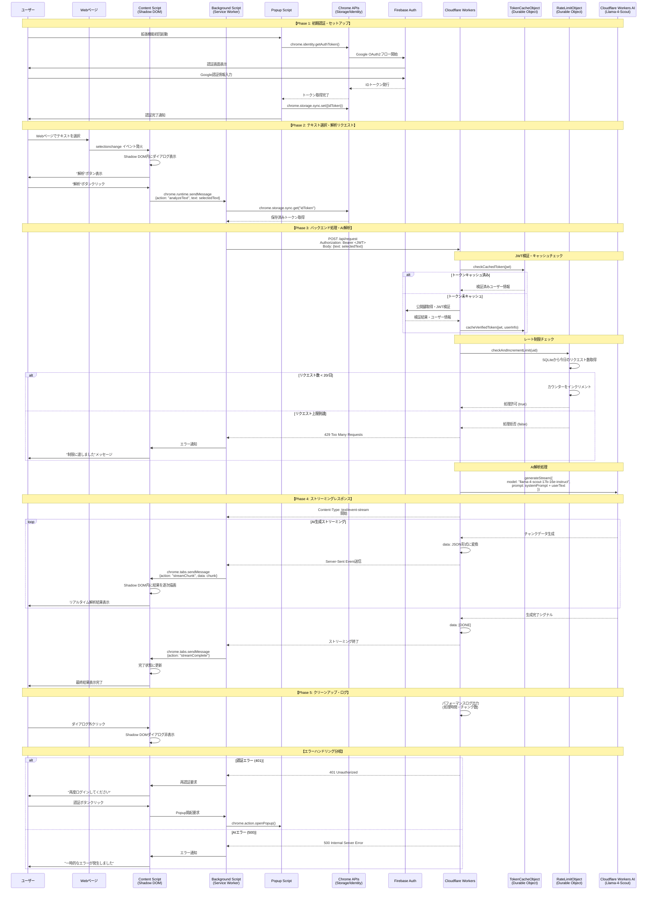

# 全体システムシーケンス図

Rocket Search AI全体のエンドツーエンド処理フローを示します。

## システム全体の特徴

### アーキテクチャパターン
- **Chrome拡張機能**: MV3準拠のService Worker型
- **バックエンド**: Serverless + Edge Computing (Cloudflare Workers)
- **AI処理**: ストリーミング対応リアルタイム生成
- **認証**: OAuth2 + JWT + Firebase連携

### パフォーマンス最適化
- **トークンキャッシュ**: Durable Objectsで重複検証回避
- **エッジ処理**: 世界各地のCloudflareエッジでレート制限・AI処理
- **ストリーミング**: Server-Sent Eventsでリアルタイム表示
- **Shadow DOM**: ホストページの干渉を排除

### セキュリティ・制限
- **レート制限**: 20リクエスト/日/ユーザー
- **JWT検証**: Firebase公開鍵による署名検証
- **権限最小化**: 必要最小限のChrome拡張機能権限
- **CORS対応**: 適切なオリジン制限

### 国際化対応
- **多言語UI**: `_locales/` での言語ファイル管理
- **AI応答**: ユーザーの言語設定に応じた解析結果